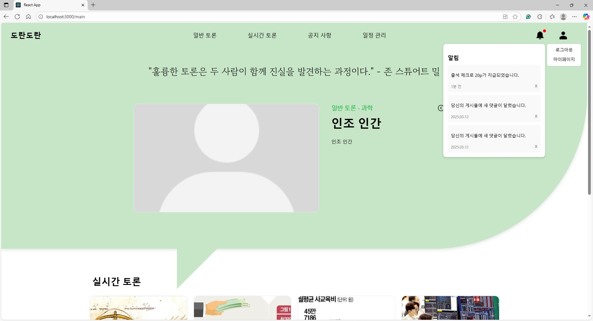
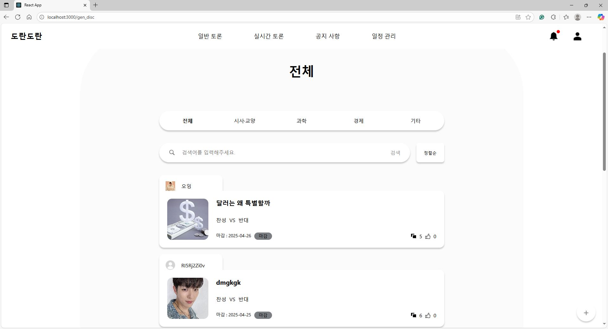
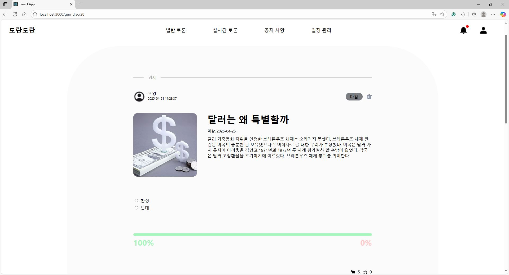
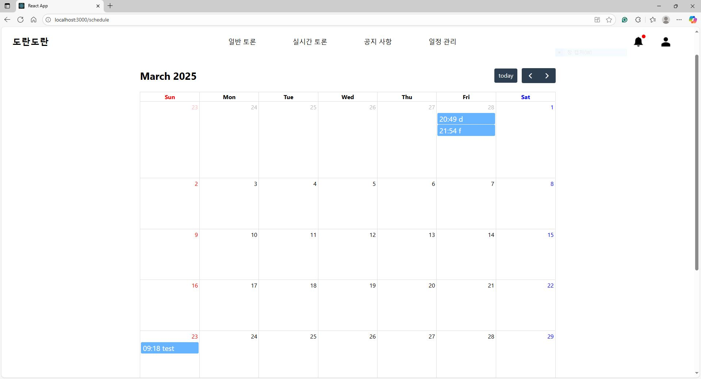
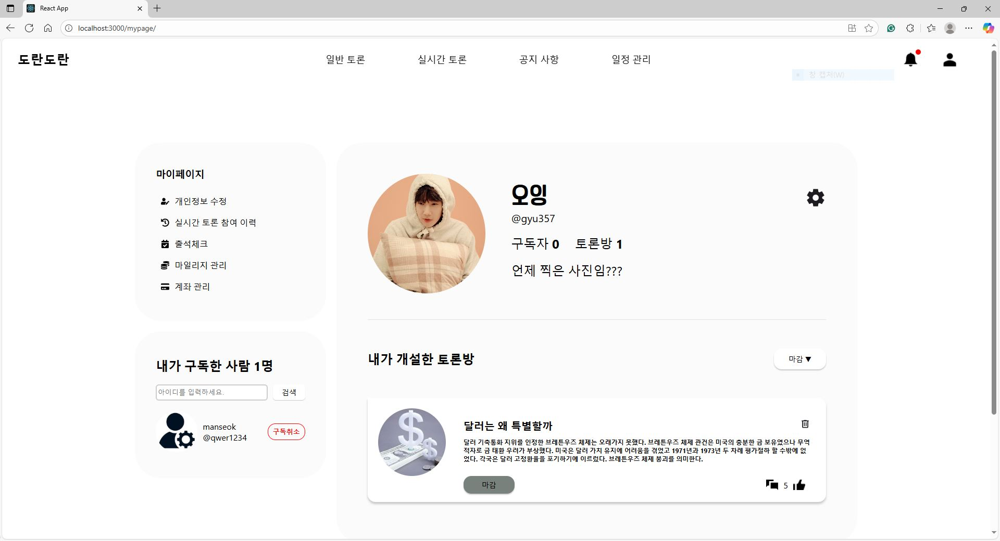
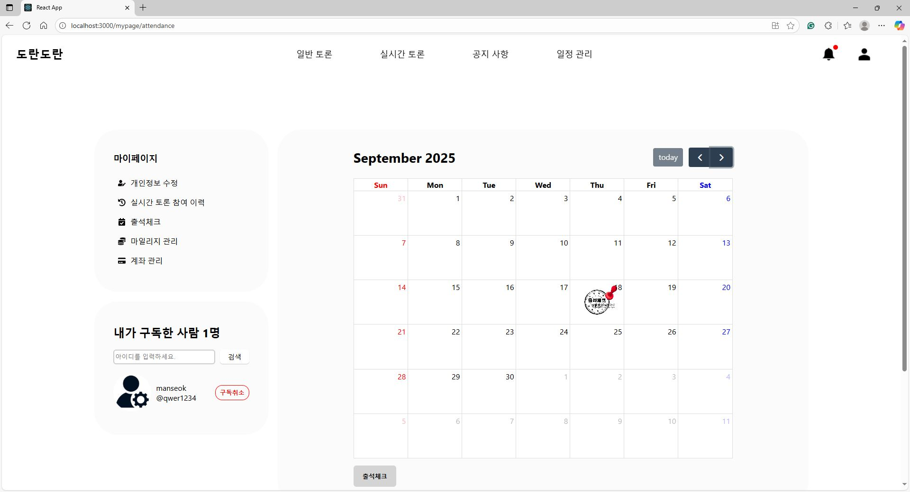
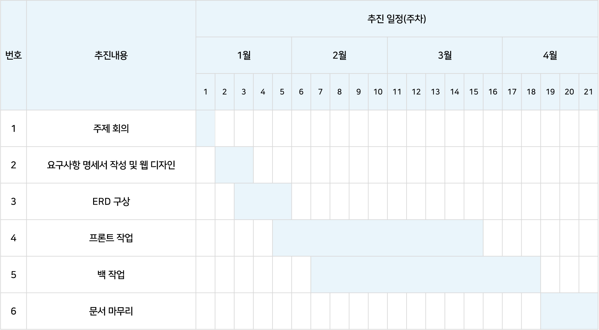

<h1 style='background-color: rgba(55, 55, 55, 0.4); text-align: center'>도란도란</h1>

해당 문서는 커뮤니티 기반 웹 서비스 '도란도란'의 프론트 서비스를 설명하고 있습니다.  

## 목차
1. [프로젝트 소개](#프로젝트-소개)
2. [개발 스택](#개발-스택)
3. [API 명세](#API-명세)
4. [폴더 구조](#폴더-구조)
5. [설치 및 실행](#설치-및-실행)
6. [주요 기능](#주요-기능)
7. [제작 기간](#제작-기간)
8. [라이선스](#라이선스)

---

## 프로젝트 소개
본 프로젝트는 사용자들이 시사/교양, 과학, 경제 혹은 기타 궁금한 주제에 관해 토론 게시글을 생성하여 자유롭게 의견을 주고 받을 수 있도록 제작한 커뮤니티 기반 웹 서비스입니다. 생성한 토론 게시글 내에서는 투표를 통해 찬반 결과 또한 얻을 수 있습니다. 또한 관리자가 주기적으로 생성하는 실시간 채팅 토론방에 참여 역시 가능합니다. 추가적으로 댓글 혹은 게시글 신고 기능과 사용자 구독 기능도 제공하고 있습니다.

이에 출석체크, 마일리지 지급(토론 참여 시, 출석체크 시, 매해 생일 마다, 혹은 기타 사유로 관리자 재량으로 제공) 및 환급 제도를 추가하였고, 마일리지나 토론 참여에 관한 모든 이벤트 발생에 대해 알림을 보내주어 접근성을 높였습니다.

JWT(Json Web Token), AuthenticationPrincipal(annotation) 활용하여 보안에 더욱 신경썼으며, 일반 계정과 관리자 계정을 따로 두어 완성도를 향상시켰습니다. 

---

## 개발 스택

<body style="font-family: Arial, sans-serif; display: flex; justify-content: center; align-items: center; height: 100vh; background-color: #f9f9f9;">
    <table style="border-collapse: collapse; width: 80%; max-width: 800px; box-shadow: 0 0 15px rgba(0, 0, 0, 0.1);">
        <tr>
            <td style="border: 1px solid #000; background-color: #e6f2f8; font-weight: bold; padding: 20px; width: 30%; text-align: center;">개발 환경</td>
            <td style="border: 1px solid #000; padding: 20px;">운영체제: Windows, macOS<br>버전 관리: GitHub</td>
        </tr>
        <tr>
            <td style="border: 1px solid #000; background-color: #e6f2f8; font-weight: bold; padding: 20px; text-align: center;">개발 도구</td>
            <td style="border: 1px solid #000; padding: 20px;">IDE: Visual Studio Code
        </tr>
        <tr>
            <td style="border: 1px solid #000; background-color: #e6f2f8; font-weight: bold; padding: 20px; text-align: center;">개발 언어 <br>및 프레임워크</td>
            <td style="border: 1px solid #000; padding: 20px;">프로그래밍 언어: TypeScript, CSS, HTML<br>프레임워크: React
        </tr>
        <tr>
            <td style="border: 1px solid #000; background-color: #e6f2f8; font-weight: bold; padding: 20px; text-align: center;">API</td>
            <td style="border: 1px solid #000; padding: 20px;">내부 API: API 명세서 확인 및 파일 업로드 API<br>외부 API: cool sms, OAuth2(Google, Naver, Kakao)</td>
        </tr>
    </table>
</body>

---

## API 명세
박현우 : https://www.postman.com/roomlyapi/dorandoran/overview

정호정 : https://documenter.getpostman.com/view/37782715/2sB2cU9NAi

김도연 : 

송태휘 :

---

## 폴더 구조

프로젝트의 주요 폴더 구조는 다음과 같습니다: 
``` 
FRONT/    
  ┣ node_modules/ # npm 종속성 모듈들이 설치된 폴더  
  ┣ public/ # 정적 파일이 포함된 폴더 (HTML, favicon 등)  
  ┣ src/ # 애플리케이션의 핵심 소스 코드가 있는 폴더  
  ┃ ┣ apis/ # API 요청 함수들이 있는 폴더  
  ┃ ┣ components/ # 재사용 가능한 UI 컴포넌트들이 위치한 폴더  
  ┃ ┣ constants/ # 상수를 정의한 파일들이 있는 폴더  
  ┃ ┣ hooks/ # 커스텀 React 훅들이 포함된 폴더  
  ┃ ┣ image/ # 해당 서비스에 사용되는 기본 이미지가 모여있는 폴더  
  ┃ ┣ layouts/ # 페이지 레이아웃 관련 컴포넌트들이 있는 폴더  
  ┃ ┣ stores/ # 상태 관리 관련 파일들 (예: 전역 상태 관리)  
  ┃ ┣ types/ # TypeScript 타입 정의 파일들    
  ┃ ┗ view/ # 개별 페이지 UI를 구성하는 컴포넌트들이 포함된 폴더   
  ┣ .env # 환경 변수 설정 파일  
  ┣ .gitignore # Git에서 추적하지 않을 파일 및 폴더 목록  
  ┣ package-lock.json # 종속성에 대한 정확한 버전 관리 파일  
  ┣ package.json # 프로젝트의 종속성 및 스크립트 정의 파일  
  ┣ README.md # 프로젝트 개요 및 설명 파일  
  ┣ 요구사항 명세서.md # 명세서 관련 Markdown 파일   
  ┗ tsconfig.json # TypeScript 설정 파일 
```

---

## 설치 및 실행

### 필수 조건
- Node.js (최소 v20.16.0)
- npm

### 설치 단계
1. 저장소 클론
   ```bash
   git clone https://github.com/DoranDoran-team/front
   ```

2. 디렉토리로 이동
   ```bash
   cd 저장소이름
   ```

3. 의존성 설치
   ```bash
   npm install @fullcalendar/react@6.1.15, @fullcalendar/timegrid@6.1.15  
   npm install @stomp/stompjs@7.0.0  
   npm install @testing-library/jest-dom@5.17.0, @testing-library/react@13.4.0, @testing-library/user-event@13.5.0  
   npm install @types/jest@27.5.2, @types/node@16.18.123, @types/react-dom@18.3.5, @types/react@18.3.18  
   npm install @axios@1.7.9
   npm install @cookie@1.0.2, @cookies@0.9.1  
   npm install @date-fns@4.1.0   
   npm install @moment@2.30.1   
   npm install @react-cookie@7.2.2, @react-dom@18.3.1, @react-icons@5.4.0, @react-router-dom@7.1.3, @react-scripts@5.0.1   
   npm install @sockjs-client@1.6.1
   npm install @typescript@4.9.5
   npm install @web-vitals@2.1.4
   npm install @zustand@5.0.3
```

4. 개발 서버 실행

  ``` bash 
    npm run start
  ```

5. 웹 브라우저에서 http://localhost:3000 열기

---

## 주요 기능
도란도란이 제공하는 주요 기능입니다.  

 1. 로그인, 아이디 찾기, 비밀번호 찾기, 회원가입
 2. 일반 회원 및 사이트 관리자 분리
 3. 일반 회원의 게시글 작성 및 투표, 댓글 기능
 4. 마이페이지 수정 및 개인 정보 수정 및 탈퇴
 5. 마일리지 적립 및 계좌 관리
 6. 유저 간 팔로우 기능 및 신고 처리
 7. 실시간 토론 기능 및 일정을 알 수 있는 달력
 8. 댓글/구독 등 알림을 확인할 수 있는 알림창
  
### 마이페이지
#### 일반 회원
 1. 프로필 수정 및 개인 정보 관리
 2. 마일리지 및 계좌 관리, 마일리지 전환
 3. 다른 유저 프로필 확인
 4. 실시간 토론 참석 여부 관리
 5. 출석 체크

#### 웹 관리자
1. 마일리지 관리
2. 신고 관리(활동 중지 및 활동 영구 금지 처리)

### 도란도란 서비스 일부 화면입니다.  

#### 1. 로그인 화면


#### 2. 메인 화면


#### 3. 알림창


#### 4. 일반 토론 게시판


#### 5. 일반 토론 게시글


#### 6. 일정 관리


#### 7. 마이페이지


#### 8. 출석 체크


---

## 제작 기간
### Timeline


### Team Roles

<table style="table-layout: fixed; width: 100%;">
  <thead>
    <tr>
      <th style="width: 20%;">이름</th>
      <th style="width: 80%;">작업 내용</th>
    </tr>
  </thead>
  <tbody>
    <tr>
      <td style="text-align: center; width: 20%;">박현우</td>
      <td>풀스택: 댓글 , 일반토론 게시물 , 투표, 좋아요 기능 구현</td>
    </tr>
    <tr>
      <td style="text-align: center; width: 20%;">송태휘</td>
      <td>풀스택: 일정 관리, 신고 기능, 출석 체크</td>
    </tr>
    <tr>
      <td style="text-align: center; width: 20%;">정호정</td>
      <td>백: Secutiry, OAuth2, 메인 화면(일반 토론), 활동 중지<br/> 
풀스택: 로그인 및 회원가입 기능,  
Notice, 개인 정보 수정, 유저 간 팔로우 </td>
    </tr>
    <tr>
      <td style="text-align: center; width: 20%;">김도연</td>
      <td>풀스택: 실시간 토론, 메인화면(실시간 토론), 알림, 마일리지 관리, 
계좌 관리, 검색 엔진 구현</td>
    </tr>
  </tbody>
</table>

#### Contributors
<table style="table-layout: fixed; width: 100%;">
  <thead>
    <tr>
      <th style="width: 20%;">이름</th>
      <th style="width: 80%;">GitHub Link</th>
    </tr>
  </thead>
  <tbody>
    <tr>
      <td style="text-align: center; width: 30%;">박현우</td>
      <td>https://github.com/bh7963</td>
    </tr>
    <tr>
      <td style="text-align: center; width: 30%;">송태휘</td>
      <td>https://github.com/Song-Tae-Hwi</td>
    </tr>
    <tr>
      <td style="text-align: center; width: 30%;">정호정</td>
      <td>https://github.com/ristukaJJang</td>
    </tr>
    <tr>
      <td style="text-align: center; width: 30%;">김도연</td>
      <td>https://github.com/pdu08075</td>
    </tr>
  </tbody>
</table>

## 라이선스
    GPL License
    Copyright (c) 2025 [DoranDoran]


